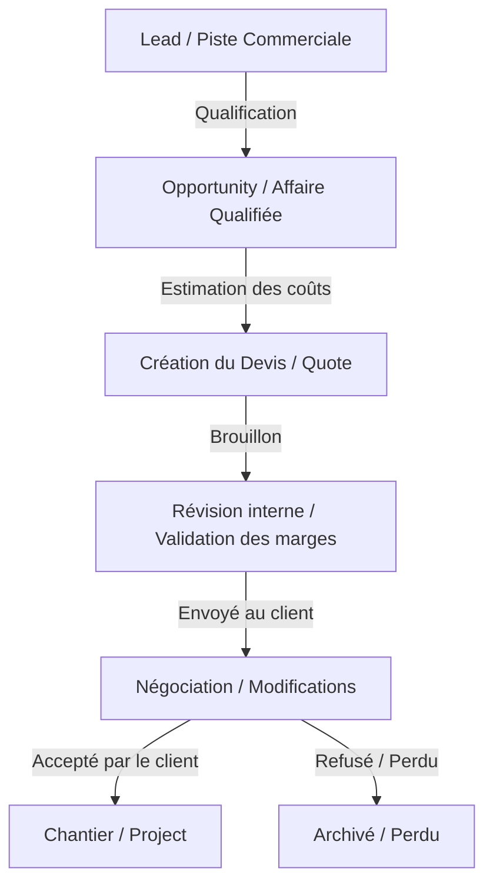
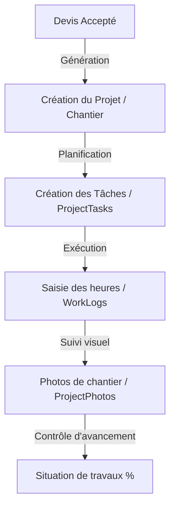
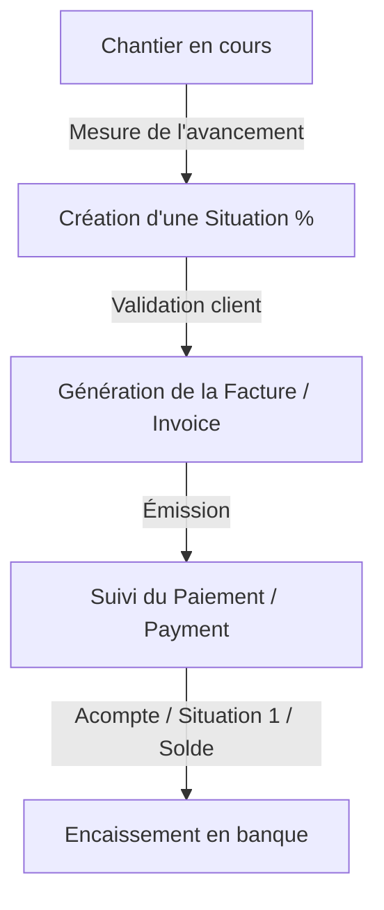

# CORE-FLOWS.md - Flux de données et cycles opérationnels

Ce document décrit de manière séquentielle les principaux flux opérationnels que l'ERP/CRM doit supporter et automatiser.

---

## 1. Cycle Commercial (CRM)

Le cycle de vente commence par la détection d'un besoin et se termine par la signature du devis.

### Règles de passage :
- **Lead -> Opportunity** : Se fait lorsqu'un commercial qualifie le besoin (il y a un budget approximatif et un planning estimé).
- **Opportunity -> Quote** : L'ingénieur chiffreur ou le commercial crée un devis détaillé avec les sections et les prix unitaires.

---

## 2. Cycle de Réalisation (Chantier / Projet)

Une fois le devis accepté, le chantier est créé automatiquement ou manuellement en se basant sur les éléments du devis.

### Événements clés :
- **Affectation des ressources** : Un ou plusieurs conducteurs de travaux sont assignés au projet, ainsi que les ouvriers.
- **Rapports d'heures (WorkLogs)** : Saisis quotidiennement ou hebdomadairement par le chef de chantier pour suivre la rentabilité de la main-d'œuvre.

---

## 3. Cycle de Facturation et d'Encaissement (Ventes/Finance)

Dans le secteur des travaux divers au Maroc, la facturation s'effectue très rarement en une seule fois. Elle suit le rythme des **situations de travaux** (facturation à l'avancement).

### Règles financières importantes :
- **Facturation à l'avancement (Situations)** : Par exemple, à 30% d'avancement du gros œuvre, on facture 30% du montant du devis pour cette section.
- **Paiements par effets/chèques** : Suivi des dates d'échéance des effets de commerce et dépôt des chèques en banque.
